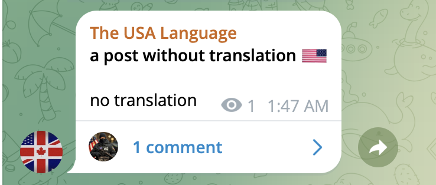
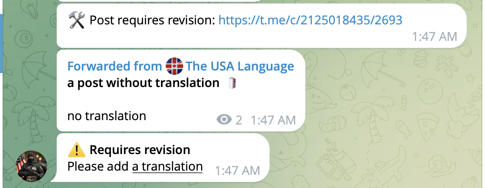
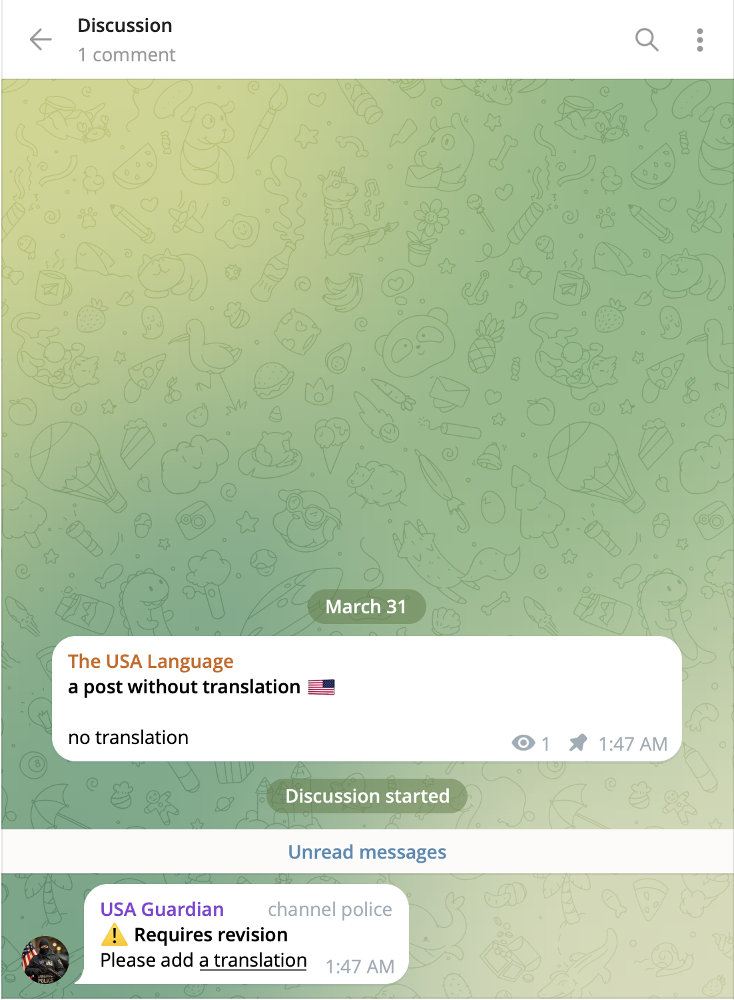

# tg-guard-netlify

Serverless Telegram bot for automated moderation of channel content.

## Overview

This project implements a Telegram bot designed to enforce content quality in a channel by automatically detecting incomplete posts and notifying maintainers.

The bot is deployed as a serverless function using Netlify and processes incoming updates via Telegram webhooks.

## Key Features

- Automated validation of channel posts
- Detection of missing content:
  - translation (Cyrillic presence)
  - explanation (for media posts)
  - required 🇺🇸 symbol
- Forwarding of problematic posts to a dedicated repair chat
- Automatic commenting in the discussion thread
- Stateless architecture with temporary persistence

## Demo

The bot automatically detects incomplete posts and enforces content rules across the channel, repair chat, and discussion threads:

### 1. Original post (missing translation)

### 2. Detection and forwarding to repair chat

### 3. Automatic comment in discussion

## Architecture

The application follows a serverless, event-driven design:

- **Entry point**: Netlify Function (`webhook.mjs`)
- **Trigger**: Telegram webhook (HTTP POST)
- **Storage**: Netlify Blobs (temporary mapping with TTL)
- **External API**: Telegram Bot API

### Flow

1. Telegram sends an update to the webhook
2. The bot analyzes the post content
3. If validation fails:
   - sends notification to repair chat
   - forwards original post
   - stores temporary state (TTL-based)
4. When discussion message appears:
   - retrieves stored state
   - posts automated comment
   - clears state

## Validation Logic

The bot determines missing elements based on:

- presence of text
- detection of Cyrillic (translation proxy)
- detection of Latin characters
- presence of media
- presence of 🇺🇸 flag

The validation rules are implemented in a deterministic function (`analyzePost`).

## Tech Stack

- **Runtime**: Node.js (ES Modules)
- **Hosting**: Netlify Functions
- **Storage**: @netlify/blobs
- **API**: Telegram Bot API

## Configuration

All sensitive data is provided via environment variables:

- `TG_BOT_TOKEN`
- `TG_WEBHOOK_SECRET`
- `CHANNEL_ID`
- `DISCUSSION_CHAT_ID`
- `REPAIR_CHAT_ID`

No secrets are stored in the repository.

## Deployment

1. Push repository to GitHub
2. Connect repository to Netlify
3. Configure environment variables
4. Set Telegram webhook to the deployed endpoint
5. Deploy

## Reliability Considerations

- Stateless function design
- TTL-based temporary storage to avoid stale data
- Graceful handling of malformed updates
- Explicit validation of webhook requests (optional secret token)

## Limitations

- Heuristic-based validation (regex for language detection)
- No persistent database (state is ephemeral)
- Assumes consistent Telegram update structure

## Future Improvements

- Replace heuristic checks with NLP-based language detection
- Add admin dashboard for moderation insights
- Introduce persistent storage for analytics
- Extend validation rules (formatting, length, etc.)

## License

MIT (or specify your preferred license)
